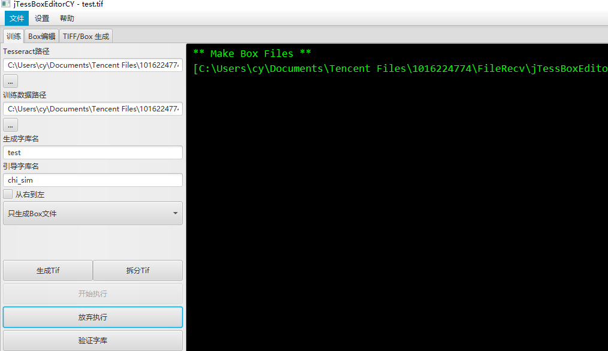
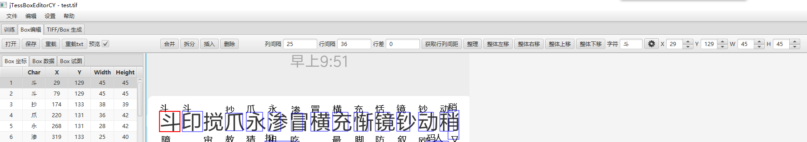
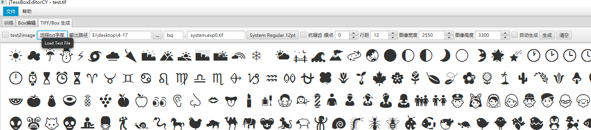

# jTessBoxEditorCY
用于tesseract中box位置标注和修改以及对box进行训练生成字库
## 项目介绍
1. tesseractTool为编译好的jar文件，运行.bat可以直接运行已编译的程序
2. test目录存放测试图片以及生成的字库
3. tesseract-ocr 可以去官方下载，也可以去[百度网盘](https://pan.baidu.com/s/1guAd6nwjVbyhIznl3tXeBw )提取码：xsnj , [github地址](https://github.com/xcatx9527/tesseract-ocr)
4. jTessBoxEditorCY为源码目录，使用IDEA开发的javaFx程序
5. 编译环境为win10+idea
6. 训练字库.bat是自己写的批处理命令，方便执行tesseract命令，跟本项目无关，想用这个命令，需要将tesseract添加环境变量
## 功能介绍与使用
---
### 训练标签功能
 
1. 设置tesseract路径和训练数据路径，如果不能选择，可以复制路径粘贴到编辑框中，然后按回车键保存
2. 生成字库名可随意命名，生成的字库放在tesseract-ocr/tessdata目录中
3. 引导字库要放在tesseract-ocr/tessdata目录中中文一般用chi_sim,不用加后缀名
4. 选择执行命令
    1. 选中只生成box文件，点击开始执行，则会根据训练数据目录中的tif文件生成对应的box文件，此时便可以点击Box编辑标签，对box进行调整
    2. 调整后选择--通过已有box进行训练--命令，点击执行，便会生成字库
    3. 点击验证字库，选择图片进行识别，就会看到识别效果

### Box编辑标签功能
 
1. 主要添加box编辑的一些快捷，优化软件结构
2. 编辑每个页面时，先将第一个字尺寸修改好，然后在想要修改的字上面点鼠标右键，可以直接修改并整理整行
3. 双击字框可以修改文字，快捷键c,使用快捷键需要修改为英文输入法
4. t键删除当前框，e键将当前选中框改变为第一个字框大小，q键复制当前选框
5. 按住鼠标左键可以横向拖动选框，竖向锁定。ctrl+鼠标左键可以多选，alt+鼠标左键可以选中两框中间所有框
6. 选中框按a,s,d,w可以调整框位置，框大小自动调整为第一个字框大小
7. z,x键可以微调字框大小

### TIFF/BOX生成标签功能
 
1. 点击选择txt字库按钮，选择要训练的text字库，字库不要太大，容易内存溢出
2. 输出路径框中设置输出路径
3. 后面两个框是命名tif用的，比如test.system.exp0.tif
4. 字体按钮选择字体和大小
5. 是否抗锯齿
6. 添加噪点
6. 生成图像宽度
6. 生成图像高度
6. 点击生成，即可生成box和tif文件，打开box查看标注是否没问题，如果没问题即可训练
---
                               --其余未谈到的功能为测试功能，不一定好用--
### 打赏
 
### 联系方式 qq 1016224774

### 鸣谢
[jTessBoxEditorFX](https://github.com/nguyenq/jTessBoxEditorFX)

